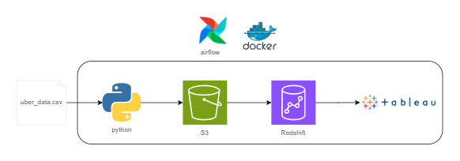
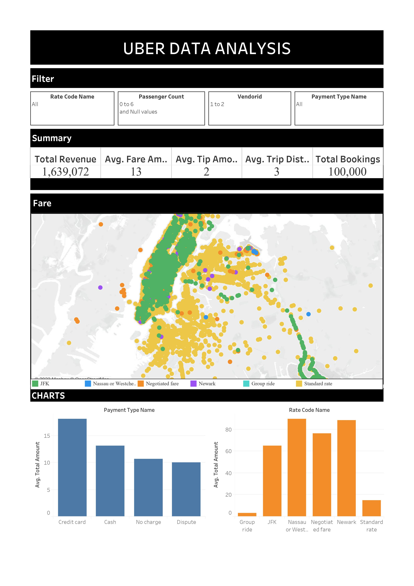

# UBER DATA ANALYSIS
## Introduction
This project's objective is to use a variety of tools and technologies, such as Python, Airflow, Docker, AWS S3, Tableau, and AWS Redshift, to do data analytics on Uber Taxi data in New York City.

## Porject Objectives
1. **Data Acquisition:** The dataset, which you acquired from the NYC government website, includes information on yellow and green cab journeys, including locations, hours, charges, and other characteristics.
2. **Data Modeling:** Creating a structured data model is the next stage. To better comprehend and analyse the data, this entails arranging it into fact and dimension tables. To draft an outline for the data's representation.
3. **Transformation:** With the data model in mind, you'll use Python and the Pandas module to transform the raw data into a format that suits your needs. This could involve cleaning, aggregating, or reformatting the data. Once transformed, the data will be loaded into a cloud storage solution.
4. **Workflow Automation (Directed Acyclic Graph, or DAG):** A task scheduling and automation tool is a DAG. In this case, the steps in your data pipeline will be managed by a DAG that you design. It guarantees that every loading and transformation step takes place at the appropriate time and in the correct order.
5. **Analytical Results:** The last step is to provide a visual interface for interacting with the changed data. This might include charts, graphs, or any other type of visual aid that enables consumers to examine and evaluate the data. It's a simple method of extracting knowledge from the processed data.

## Architecture 

## Tools and Technology used
* __Python :__ Subsequently, I devised and implemented sophisticated transformation logic using Python, a versatile programming language widely employed in data engineering tasks.
* __Docker :__  Docker is a software platform that simplifies the process of building, running, managing and distributing applications. It does this by virtualizing the operating system of the computer on which it is installed and running.
* __Tableau :__ Tableau is a powerful data visualisation and business intelligence tool that helps people see and understand their data. It allows users to connect to various data sources, create interactive and insightful dashboards, and share the visualisations with others.
* __Airflow :__ Apache Airflow is like a virtual assistant for managing and scheduling complex tasks. It helps you automate workflows, making it easier to organise and execute a series of tasks in a specific order. Imagine it as a digital choreographer that ensures your computer-based tasks, like data processing or report generation, happen smoothly and on time.
* __AWS Services :__
    * __S3 :__ Amazon Simple Storage Service (Amazon S3) is like a giant virtual hard drive in the cloud. It's a service provided by Amazon Web Services (AWS) that allows you to store and retrieve any amount of data from anywhere on the web.
    * __Redshift :__ Amazon Redshift is like a super-fast and scalable file cabinet in the cloud for storing and quickly finding really big sets of data. It's great for businesses that need to analyze massive amounts of information to make smart decisions.

## Dataset Used
TLC Trip Record Data Yellow and green taxi trip records include fields capturing pick-up and drop-off dates/times, pick-up and drop-off locations, trip distances, itemized fares, rate types, payment types, and driver-reported passenger counts.
* Link to Website - https://www.nyc.gov/site/tlc/about/tlc-trip-record-data.page
* Link to Data Dictionary - https://www.nyc.gov/assets/tlc/downloads/pdf/data_dictionary_trip_records_yellow.pdf

## Data Model
Data Model consists of 1 fact table and 7 dimension tables.

## Analytics Dashboard

